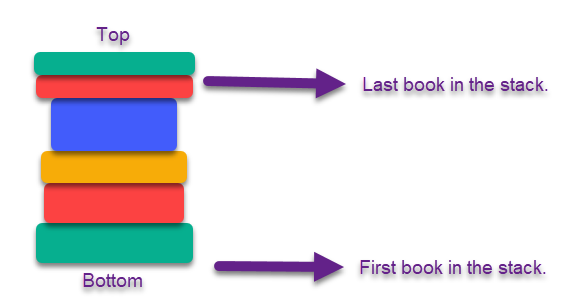

# Stacks - Fundatemental Data Structure
<!-- Created the basic outline. Need to add information.-->

## Introduction
### What is a stack?
A stack is a data structure. 
Whether something is a stack is determined by the order that items are added or removed. 
The order is based on the principle **"Last In, First Out"**.

### How does the stack work?
To make our principle of "Last In, First Out" easier to understand, think of a stack of books.
<!-- Insert book image. -->

<!-- Rest of explantion -->
The book on the bottom will have been the first book in the pile. 
The book on the top will be the last book added onto the pile. 
However, to reach the book on the bottom, you will have to take the books off the top of the pile first. 
Hence our principle of "Last In, First Out".

## Undoing in Stacks
A common usage of Stacks is the undo function in applications. 
A lot of applications such as Word, Excel, Visual Studio Code, and more have an undo button. 
<!-- Insert a picture of the undo button. -->


### How the "Undo" Works
Returning to our book analogy, the undo works like taking a book off the stack. The top book (or word) will be taken (popped) off the stack. Then the next book can be taken off and so on. 

Lets take a look of how this works!

## Example
 <!-- Doing a text block of python code to demostrate stacks. -->

Stacks are represented using a list.
```python
myStack = ["Beauty and the Beast", "Romeo and Juilet", "The Fault in Our Stars"]
```

To add an item to my stack, I need to use the push(value) operation.
```python
myStack.append("The Scarlet Letter")
```

To remove an item in my stack, I need to use the pop() operation. 
```python
removeBook = myStack.pop()
```
REMEMBER this will only take off the top item in the stack. 

You can access the size of your stack using the size() operation.
```python
length = len(myStack)
```

You can also check to see if the stack is empty. 
This also helps with creating a function to check for this.
```python
if len(myStack) == 0:
    print("Stack is empty.")
```

## Problem to Solve
Now it is up to you to create and modify your first stack!
Download the following file. 

[Stack Problem](stackProblem.py)

You are going to create your grocery list using your newfound stack knowledge.
Please attempt the problem on your own. 
Once you have finished or spent at least an hour attempting the problem, 
feel free to look at the solution provided below.

[Stack Solution](stackSolution.py)