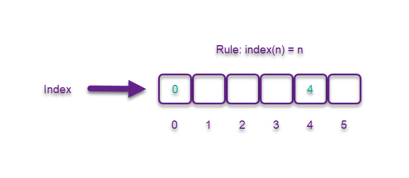
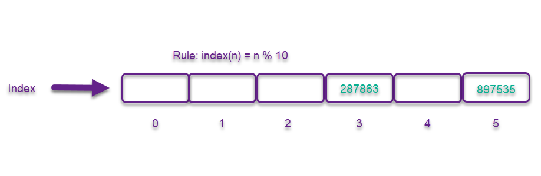
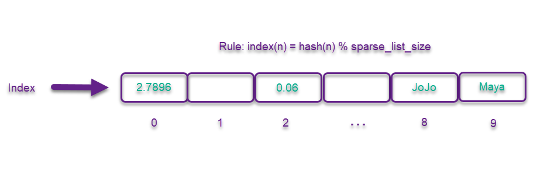

# Sets- Fundamental Data Structures

## Introduction

In this section, you will be learning about sets. 

### What is a set?
A set is a data structure that doesn't need to be order 
and can't contain any duplicates. 
This makes the data easier to find and access. 
This can be done in O(1) time. 
This can be achieved by using a technique called Hashing. 

## Hashing
Hashing is when we apply the rule (aka function) **index(n) = n**.
I want to make a list of numbers. 
I want the numbers in this list to range from 0 to 5.
Using our rule, index(n) = 4. 
So our number 4 will go into index 4. 

<!-- Insert hashing picture. -->


Our rule can be modified to include larger numbers. 
It would look like **index(n) = n % 10**.
The remainder is telling us where in the index our number should fall. 

<!-- Insert modulo hashing picture. -->


Our rule can be modified again to all for strings or floats. 
It would look like **index(n) = hash(n) % sparse_list_size**.
Hash(n) represents a hashing fuction. 
A hashing function will convert non-integers into interggers
so that modulo can be used. 
You will use the built in Python has function. 

<!-- Insert floats and strings hashing picture.-->


## Example
Let's create a set together. 
In Python, a set is created using curly braces.
Unless, the set is empty. 
Then you would use set().

```python
emptySet = set()

mySet = {0, 4, 6}
```

Lets add a few values to our set. 
This is done by using the add(value) operation. 

```python
mySet.add(8)

print(mySet)
```

Now let's remove something from our set.
This is doing use the remove(value) operation.

```python
mySet.remove(0)

print(mySet)
```

I want to know if 10 is in our set.
This can be done using the member(value) operation.
It looks like this in Python.

```python
if 10 in mySet:
    print("There is a 10 in your set.")
else:
    print("There is no 10 in your set.")
```

You can also check for the size of your set. 

```python
length = len(mySet)

print(length)
```

## Problem to Solve
Now it is your turn to try and create your own set. 
There are going to be four problems for you to try out. 

[Stack Problem](stackProblem.py)

Attempt this on your own first or have worked on it for an hour
before checking the solution. 
The solution is linked below for you to use. 

[Stack Solution](stackSolution.py)