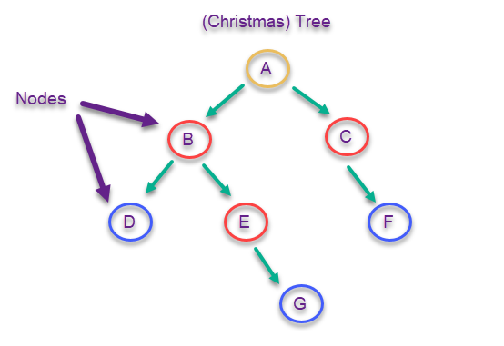
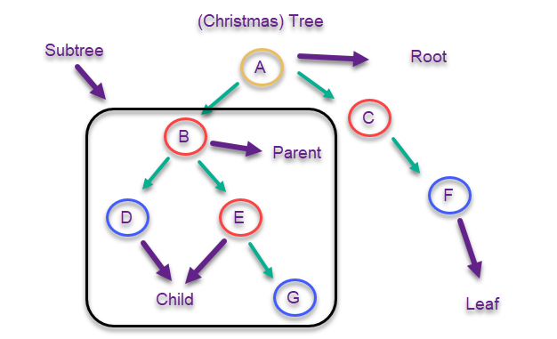
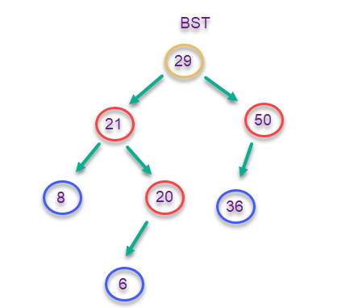
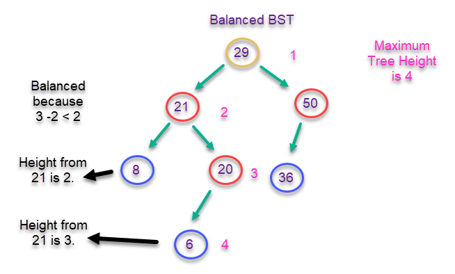

# Tree- Fundamental Data Structure

## Introduction
Trees are similar to a linked list. 
The difference is that a tree can connect to multiple nodes. 
The trees will look something like a Christmas tree. 



### Common Terminology
The top node is called the **root** node. 
The star on top the Christmas tree (or in this case the gold node A)
is our root node.

A **leaf** is a node that connects to no other nodes. 
In our christmas tree picture, they are the blue ornaments. 

A node that connects other to other nodes is called a **parent** node. 
In our christmas tree analogy, they were the red ornamnets. 

A **child** node is one that connects to a parent node. 
Any of the red or blue ornaments in our Christmas tree analogy 
could be a child node. 

Any nodes to the left and right of a prent node could form a **subtree**.
In our christmas tree picture, B can be the start of a subtree. 



### Different Kinds of Trees

**Binary Tree**

A binary tree is a tree that links no more than two other nodes. 
Our Christmas tree is a binary tree. 

**Binary Search Tree**

A binary search tree (BST) follows rules for that data that goes in the tree. 
The rules are as follows. 

1) Every node gets compared to the parent node.
2) If the data being added in is *less* than the parent node
it gets added to the *left* subtree. 
3) If the data being added in is *more* than the parent node
it gets added to the *right* subtree. 
4) Duplicates can be put on either side of the tree. 



**Balanced BST**

A balanced BST occurs when there is not a dramatic difference 
between the height of any two subtress. 
The typical rule for this is that difference of height 
between subtrees is less than 2. 

The height of a tree is found by counting the the maximum number of nodes
between the root and leaves.



## Example

How we create and insert into a BST.

```python
# Creating a class that will act as our BST
class BST:

    # Creating a function to 
    def insert(self, data):
        """
        Creating the root node. 
        If there is already a root node, call our insert function.
        """
        # Conditional statement
        if self.root is None:
            # Assign the root.
            self.root = BST.Node(data)
        else:
            # Call our insert function
            self._insert(data, self.root)  # Start at the root

    def _insert(self, data, node):
        """
        This function will look for a place to insert a node
        with 'data' inside of it.  The current subtree is
        represented by 'node'.
        """
        if data < node.data:
            # The data belongs on the left side.
            if node.left is None:
                # We found an empty spot
                node.left = BST.Node(data)
            else:
                # Need to keep looking.  Call _insert
                # recursively on the left subtree.
                self._insert(data, node.left)
        elif data >= node.data:
            # The data belongs on the right side.
            if node.right is None:
                # We found an empty spot
                node.right = BST.Node(data)
            else:
                # Need to keep looking.  Call _insert
                # recursively on the right subtree.
                self._insert(data, node.right)
```

## Problem to Solve
Since trees are a lot to learn about at once, there is only one problem that needs to be solved. That problem is linked below. You will be writing how to traverse the tree. 

[Tree Problem](treeProblem.py)

Attempt this on your own first or have worked on it for an hour
before checking the solution. 
The solution is linked below for you to use. 

[Tree Solution](treeSolution.py)